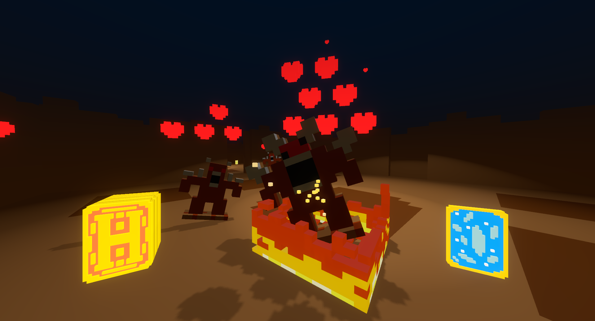

# Heart of the Cards </img>
Heart of the Cards is a trading card game first person shooter. It has elements of both, though the core gameplay loop is most familiar to FPS players. In the game, you fight against waves of enemies in an arena, using magical trading cards as your weapons. Getting hit by enemies makes you drop cards, and killing enemies makes them drop cards. If you lose all of your cards, you lose the game. It's an entry to [Ludum Dare 41](https://ldjam.com/events/ludum-dare/41). Made with the Godot engine, using models made in MagicaVoxel.

## External resources used
- [MagicaVoxel Importer](https://godotengine.org/asset-library/asset/162) by Scayze; MIT license

## Distribution
You can get the binaries on [itch.io](https://nc.itch.io/heart-of-the-cards) or [my website](https://trash.neon.moe). The game is distributed under the terms of the [GNU GPLv3 license](LICENSE.md).

## Screenshots

